# springboot003-基于SpringBoot的图书个性化推荐系统

>  博主介绍：
>  Hey，我是程序员Chaers，一个专注于计算机领域的程序员
>  十年大厂程序员全栈开发‍ 日常分享项目经验 解决技术难题与技术推荐 承接各类网站设计，小程序开发，毕设等。
>  【计算机专业课程设计，毕业设计项目，Java，微信小程序，安卓APP都可以做，不仅仅是计算机专业，其它专业都可以】

## 3000套系统可挑选，获取链接：https://chaerspol.github.io/

<b>QQ【获取完整源码】：674456564</b>

<b>QQ群【获取完整源码】：1058861570</b>

### 系统架构

> 前端：html | js | css | jquery | vue
>
> 后端：springboot | mybatis
> 
> 环境：jdk1.8+ | mysql | maven

# 一、内容包括
包括有  项目源码+项目论文+数据库源码+答辩ppt+远程调试成功

# 二、需求分析

**2.1 可行性分析**

在系统开发之初要进行系统可行分析，这样做的目的就是使用最小成本解决最大问题，一旦程序开发满足学生需要，带来的好处也是很多的。下面我们将从技术上、操作上、经济上等方面来考虑这个系统到底值不值得开发。

**2.1.1 技术可行性**

本图书个性化推荐系统采用Spring Boot框架、JAVA编程语言和MYSQL数据库进行开发设计，作为计算机专业学生，在学校期间就接触到许多关于编程方面的知识，当然也包括各种编程软件，对他们的了解度也比较熟悉，所以技术开发上面还是有一定把握。

**2.1.2经济可行性**

我在设计该系统的时候主要是从节约成本出发，然后进行具体的系统的设计，在系统的设计过程中由于采用的所有工具以及技术支持全部都是免费的，因此不需要有任何的成本就可以进行该系统的设计。所用到的所有资源都是免费的，只要有网络就可以进行下载使用，不需要支付相应的费用，因此该项目在经济方面是完全可以实行的。

**2.1.3操作可行性**

本人自己就是学生，程序开发经验不足，在界面设计上面不会设计太复杂，要讲究简单好看，操作上要方便，不能让学生觉得不流畅。学生一旦进入操作界面，界面上就会有相应提示，跟着操作提示就可以找到对应的功能操作模块，对于学生来说免培训就能使用。
从上面几个部分的可行性分析得出，这次开发的图书个性化推荐系统在开发上面没有什么大问题，值得开发。

**2.2 系统性能分析**

（1）系统响应效率：页面响应时问应该在3秒以内，最长不能超过4秒，并支持至少10000人同时在线所有系统。

（2）界面简洁清晰：系统界面要求简单明了，容易操作，符合学生操作习惯。

（3）储存性高：因为图书个性化推荐系统中有很多的信息需要存储，因此对于系统的存储量有很大的要求，需要有一个强大的数据库的支持才能确保所有的信息都能安全稳定的进行存储。

（4）易学性：该系统在操作上必须简单好上手，没有很多复杂的操作，只需要简单的进行学习就能操作该系统。

（5）稳定性需求：开发的图书个性化推荐系统 要求运行稳定，运行过程中无界面不清楚、字体模糊等现象。

**2.3系统流程分析**

**2.3.1登录流程**

登录模块主要满足管理员以及学生的权限登录，学生登录流程图如图所示。

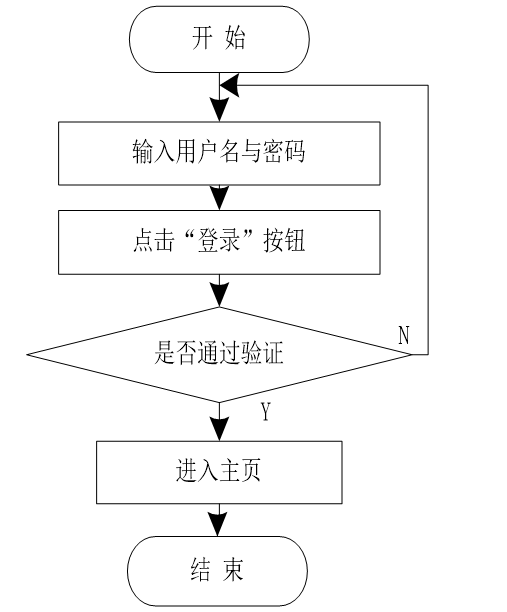

**2.3.2注册流程**

未有账号的学生可进入注册界面进行注册操作，学生注册流程图如图所示。

**2.3.3添加信息流程**

学生在添加信息时，信息编号自动生成，系统会对添加的信息进行验证，验证通过则添加至数据库，添加信息成功，反之添加失败。添加信息流程如图所示。

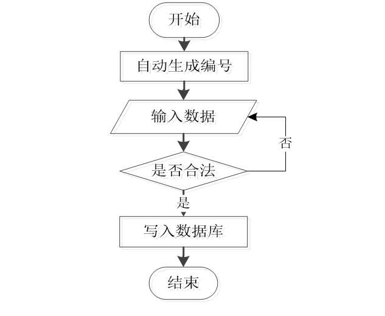

**2.3.4删除信息流程**

学生可选择要删除的信息进行信息删除操作，在删除信息时系统提示是否确定删除信息，是则删除信息成功，系统数据库将信息进行删除。删除信息流程图如图所示。

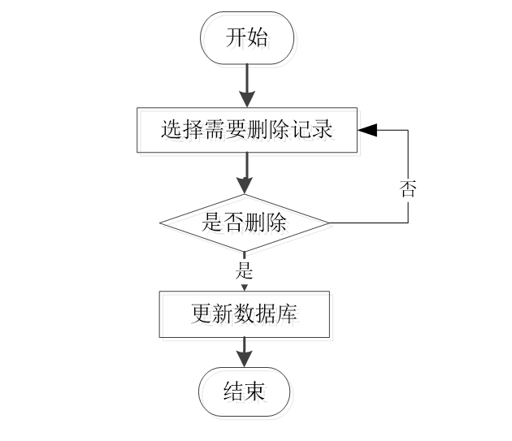

# 三、运行环境

> jdk版本：1.8 及以上； ide工具：IDEA； 数据库: mysql5.7及以上；编程语言: Java

# 四、功能模块

系统功能分析

本图书个性化推荐系统主要包括二大功能模块，即学生功能模块和管理员功能模块。
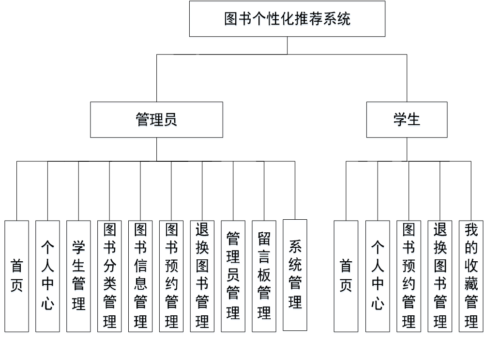

（1）管理员模块：系统中的核心用户是管理员，管理员登录后，通过管理员功能来管理后台系统。主要功能有：首页、个人中心、学生管理、图书分类管理、图书信息管理、图书预约管理、退换图书管理、管理员管理、留言板管理、系统管理等功能。管理员用例图如图所示。
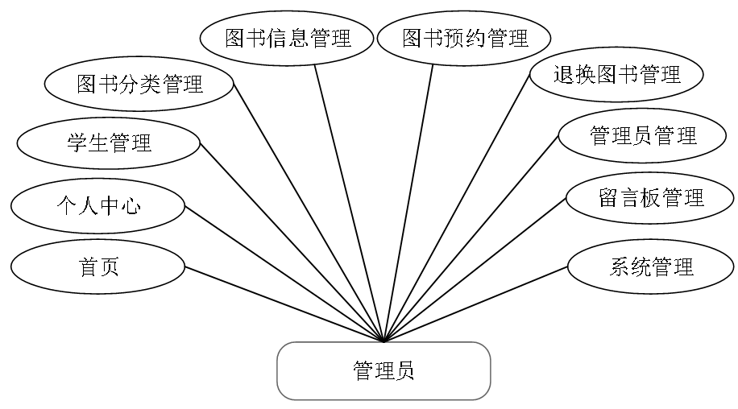

（2）学生：首页、个人中心、图书预约管理、退换图书管理、我的收藏管理等功能，学生用例图如图所示。
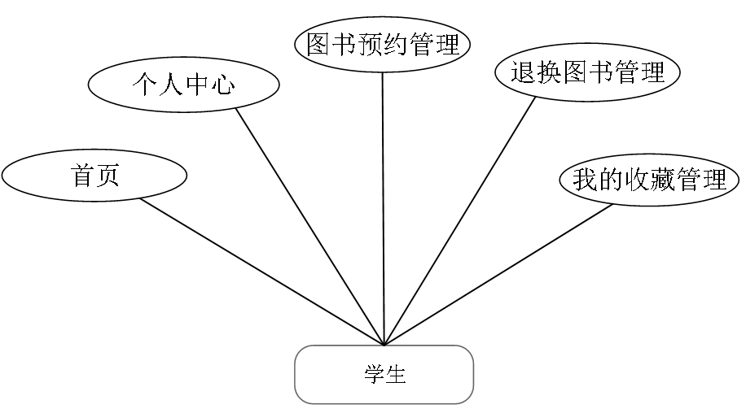

（3）前台首页：首页、图书信息、好书推荐、留言反馈、个人中心、后台管理等功能，前台首页用例图如图所示。
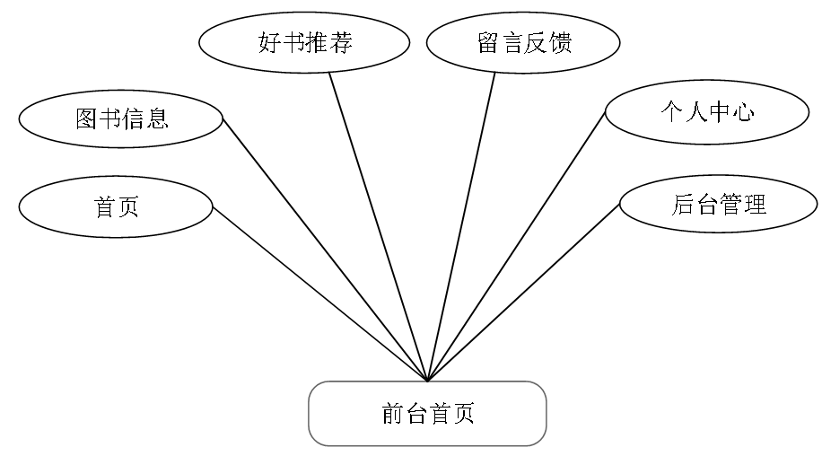

# 五、部分效果图展示

图5-1首页功能界面图【图书个性化推荐系统，在前台首页可以查看首页、图书信息、好书推荐、留言反馈、个人中心、后台管理等内容】
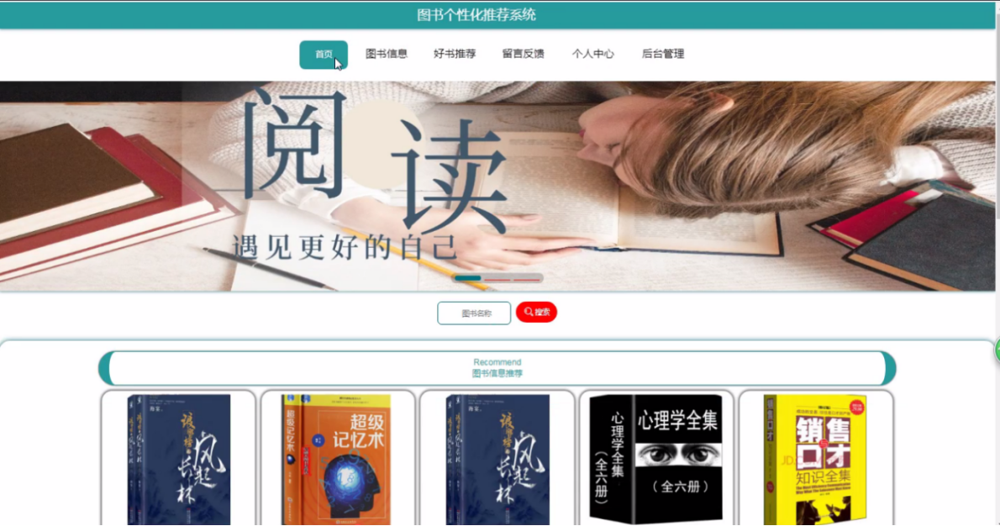

图5-2学生注册、登录界面图【 学生注册、登录，在学生注册页面可以填写学号、密码、学生姓名、性别、出生日期、联系电话、班级等信息进行注册、登录】
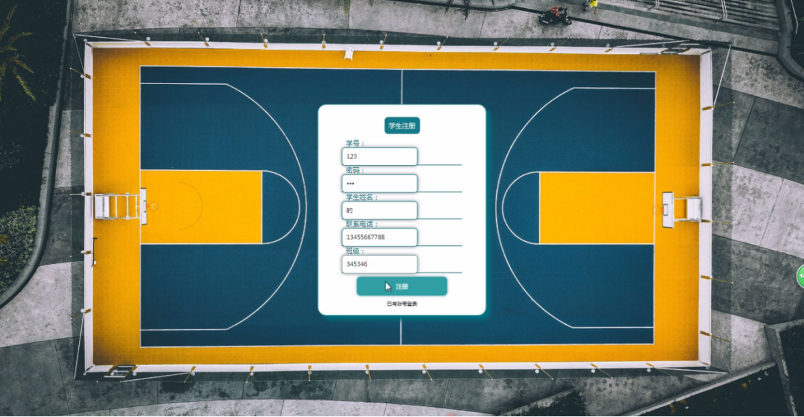

图5-3图书信息界面图【图书信息，在图书信息页面通过查看图书编号、图书名称、图书类别、图片、作者、出版社、版次、数量、点击次数等信息进行预约、立即提交或点我收藏操作】
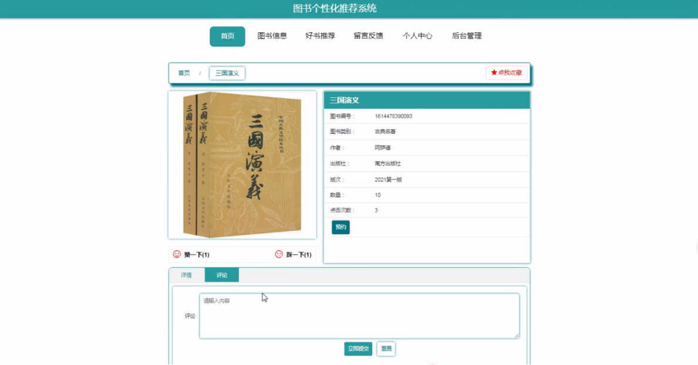

图5-4个人中心界面图【在个人中心页面通过填写学号、密码、学生姓名、性别、出生日期、联系电话、班级等信息进行更新信息、退出登录操作】

图5-5管理员登录界面图【管理员登录，通过填写输入用户名、密码、角色进行登录】

图5-6学生管理界面图【学生管理，在学生管理页面中可以通过查看学号、密码、学生姓名、性别、出生日期、联系电话、班级等内容进行修改、删除等操作，如图5-6所示。还可以根据需要对图书分类管理进行修改或删除等详细操作】
 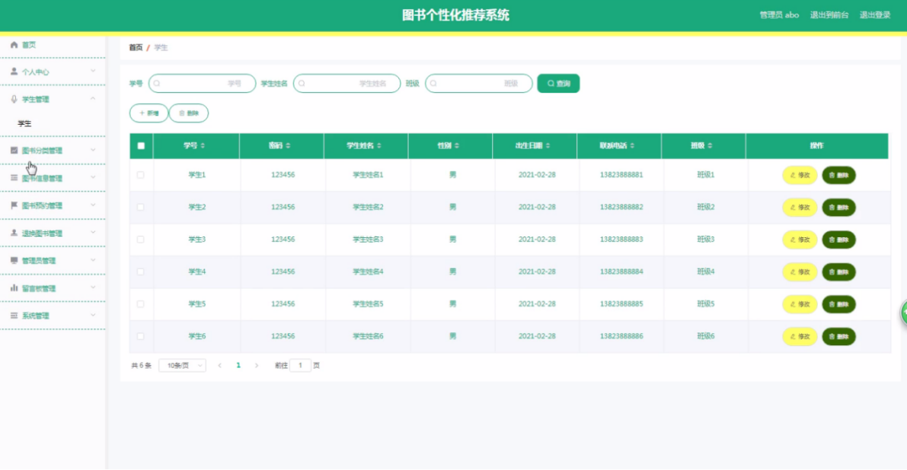

 <b>完整文章</b>
 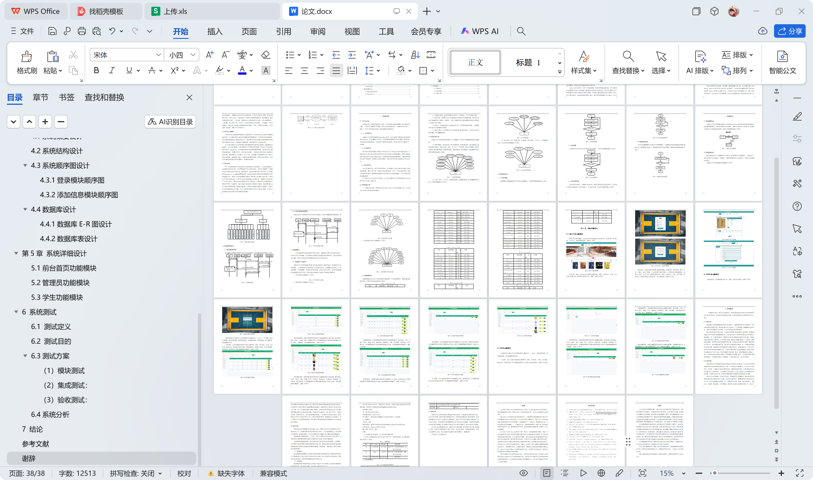

 

## 3000套系统可挑选，获取链接：https://chaerspol.github.io/

<b>QQ【获取完整源码】：674456564</b>

<b>QQ群【获取完整源码】：1058861570</b>

